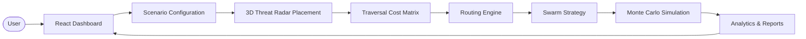
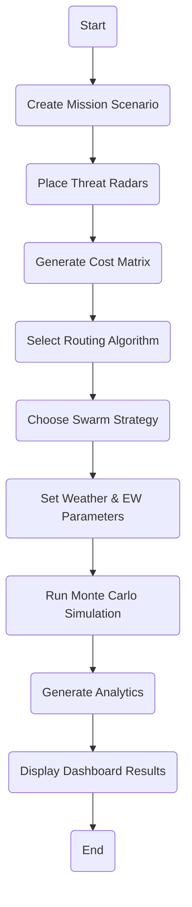
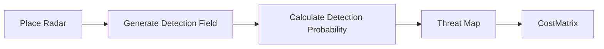
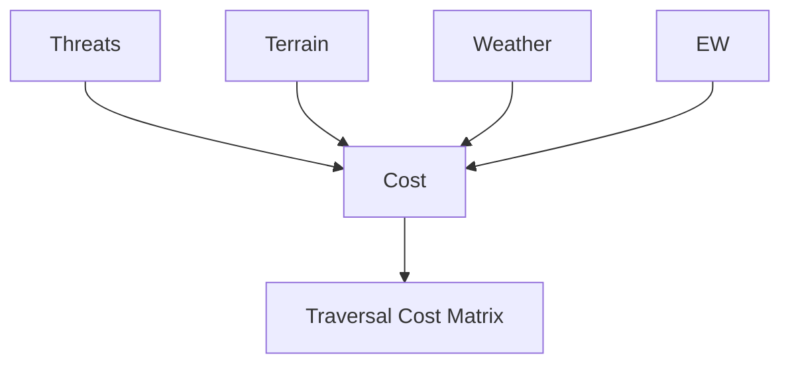
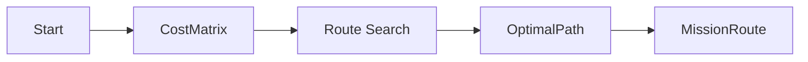
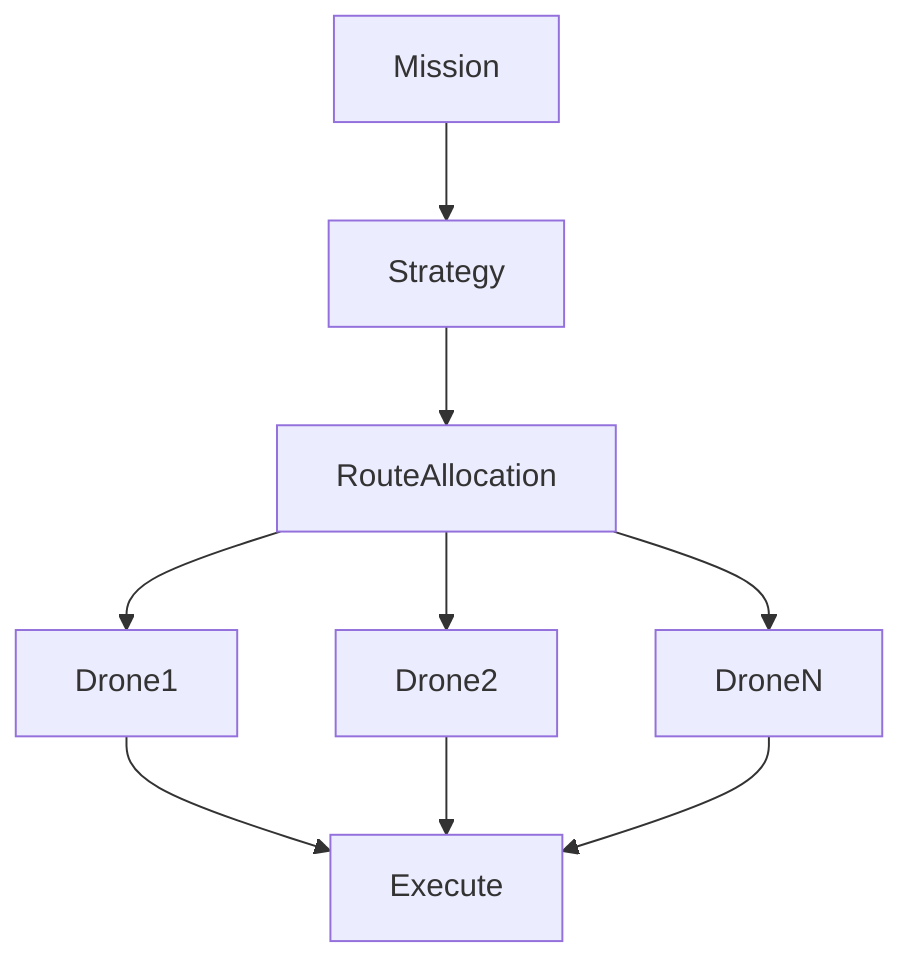
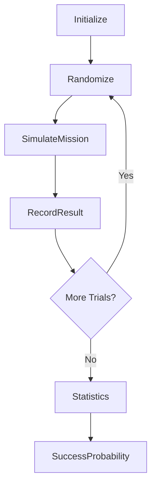
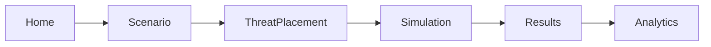

# Drone Swarm Simulation in a Contested Environment

## 🎥 Project Demonstration

**Demo Video:** https://example.com/demo-video

**Project Screenshots:** https://example.com/project-gallery

---

## Project Overview

Drone Swarm Simulation in a Contested Environment is an internship project that simulates autonomous UAV swarm missions in hostile operational environments. The platform enables users to create mission scenarios, place 3D threat radars, generate traversal cost matrices, select routing algorithms, configure swarm deployment strategies, and perform Monte Carlo simulations to evaluate mission success under uncertain conditions.

The system combines a modern React dashboard, Node.js backend, Python simulation pipeline, and C++ computation engine to model realistic operational challenges such as radar detection, electronic warfare, environmental effects, and probabilistic mission outcomes.

---

#  Key Features

- 3D Threat Radar Placement
- Traversal Cost Matrix Generation
- Terrain-Aware Route Planning
- Multiple Swarm Deployment Strategies
- Monte Carlo Simulation
- Electronic Warfare (EW) Modeling
- Environmental Effects
- Interactive Dashboard
- Heatmaps & Analytics
- Statistical Performance Reports

---

#  System Architecture



The application follows a modular pipeline where users configure scenarios, generate threat-aware cost maps, compute routes, execute swarm simulations, and visualize mission analytics through the dashboard.

---

#  Project Workflow



---

#  Core Modules

##  Threat Radar Placement

Threat radars are positioned in a 3D operational environment to model hostile surveillance zones. Each radar generates a probabilistic detection field that influences route planning.

### Workflow



**Dashboard Screenshot**


---

##  Cost Matrix Generation

The cost matrix combines terrain, threat probability, weather, and Electronic Warfare effects into a single traversal cost used by routing algorithms.

### Cost Generation Process



Higher threat exposure increases traversal cost, encouraging safer route selection.

**Dashboard Screenshot**


---

##  Routing Algorithms

The routing engine computes efficient and safe UAV paths by minimizing traversal costs while satisfying mission constraints.

### Routing Pipeline



### Algorithm Comparison

| Algorithm | Purpose | Advantages | Limitations |
|-----------|---------|------------|------------|
| A* | 2D Path Planning | Fast & Optimal | High memory on large maps |
| Lazy 3D A* | 3D Path Planning | Memory Efficient | More complex implementation |

**Dashboard Screenshot**


---

##  Drone Swarm Strategies

The swarm module coordinates multiple drones using different deployment strategies.

Supported strategies:

- Single Route
- Split Routes
- Decoy Lead
- Distributed Routing

### Strategy Workflow



**Dashboard Screenshot**


---

## Monte Carlo Simulation

Monte Carlo simulation evaluates mission success through repeated randomized trials.

Randomized factors include:

- Radar Detection
- Weather
- Electronic Warfare
- Communication Loss
- Failure Probability

### Simulation Loop



Mission success probability is calculated from thousands of simulation iterations, providing statistically significant estimates of mission reliability.

**Dashboard Screenshot**


---

##  Dashboard Application

The dashboard provides an intuitive interface for configuring scenarios, executing simulations, and visualizing results.

### Dashboard Navigation



Features include:

- Interactive Scenario Builder
- Threat Placement
- Route Visualization
- Swarm Configuration
- Mission Analytics
- Heatmaps
- Charts
- Statistical Reports

**Dashboard Screenshot**


---

# Results

Generated analytics include:

- Mission Success Probability
- Detection Rate
- Route Efficiency
- Swarm Survivability
- Heatmaps
- Threat Maps
- Performance Charts

**Results**


---

# Project Structure

```text
project/
├── frontend/
├── backend/
├── pipeline/
│   ├── path_planner/
│   ├── swarm_simulation/
│   ├── env_generator/
│   └── cpp_engine/
├── runs/
├── images/
└── README.md
```

---

# Future Enhancements

- AI-based Route Planning
- Reinforcement Learning
- Multi-Agent Coordination
- Live Telemetry
- Dynamic Weather APIs
- GPU Acceleration
- Distributed Simulations
- Real-time Visualization

---

# Contributors

- Yojit Jindal
- Ayush Aggarwal
- Ritisha Sood


---

# 🙏 Acknowledgements

We sincerely thank our internship mentors, faculty members, teammates, and the open-source community for their continuous support and guidance throughout this project.
